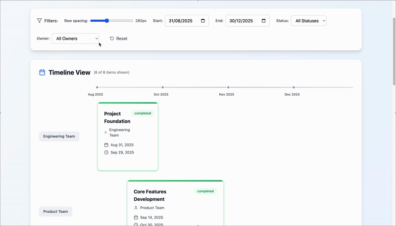

# Interactive Roadmap Project (Vite + React + TypeScript)

This is a simple Vite + React + TypeScript app for generating an interactive roadmap.

<p align="center">
  <a href="https://interactive-roadmap.pages.dev/" target="_blank">
    
  </a>
</p>

<p align="center">
  <a href="https://interactive-roadmap.pages.dev/" target="_blank">
    
  </a>
</p>

## Table of Contents
- [Usage](#usage)
  - [Prerequisites](#prerequisites)
  - [Install](#install)
  - [Run](#run)
  - [Build](#build)
  - [Preview](#preview)
  - [Add Roadmap Items](#add-roadmap-items)
- [Development](#development)
  - [Lint](#lint)
  - [Environment Variables](#environment-variables)
  - [Use with Bun](#use-with-bun)
  - [Use with Deno](#use-with-deno)
  - [Common Issues](#common-issues)
- [License](#license)

## Usage

### Prerequisites
- Node.js 22 (project includes `.nvmrc`). Use `nvm use` if available. You can also use [Bun]((#use-with-bun)) or [Deno]((#use-with-deno))
- npm (lockfile is `package-lock.json`). Yarn/Pnpm also work if you prefer.

### Install
```bash
npm install
```

### Run
```bash
npm run dev
```
- Starts Vite dev server (default: http://localhost:5173).
- Supports hot module replacement (HMR).

### Build
```bash
npm run build
```
- Outputs static assets to `dist/`.

### Preview
```bash
npm run preview
```
- Serves the built `dist/` locally to verify the production bundle.

### Add Roadmap Items
- Data source: edit `src/data/roadmapData.ts` and append to the `roadmapItems` array. Each item uses:
  - `id`: unique string (e.g., `"7"`).
  - `name`: short, human-friendly title.
  - `startDate` / `endDate`: `YYYY-MM-DD` (local date).
  - `details`: markdown path under `public/markdown` (e.g., `/markdown/my-feature.md`).
  - `status`: one of `completed`, `in-progress`, `planned`.
  - `owner`: team/owner label; new owners automatically get their own row.

- Details content: create the referenced markdown file in `public/markdown/` (e.g., `public/markdown/my-feature.md`). The modal supports GitHub-flavored Markdown (tables, lists, etc.).

- Viewing: in dev, HMR reloads after saving. In production, rebuild with `npm run build` and preview with `npm run preview`.

- Notes:
  - Filters and owner list are derived from your data automatically.
  - Items outside the visible timeline won’t show until you adjust the Start/End date controls at the top of the page.
  - If introducing a new `status` value, update:
    - The `status` union type in `src/data/roadmapData.ts`.
    - `statusColors`, `statusBorders`, `statusText`, `statusBg` in `src/components/RoadmapItem.tsx`.
    - The legend in `src/components/RoadmapVisualizer.tsx`.

## Development

### Lint
```bash
npm run lint
```

### Environment Variables
- Create a `.env` file if needed.
- Only variables prefixed with `VITE_` are exposed to the client (e.g. `VITE_API_URL=`).

### Use with Bun
- Prerequisite: Bun 1.0+ installed (`bun -v`).
- Install dependencies:
  ```bash
  bun install
  ```
- Run dev server:
  ```bash
  bun run dev
  # or, if Bun auto-detects scripts
  bun dev
  ```
- Build for production:
  ```bash
  bun run build
  ```
- Preview the production build:
  ```bash
  bun run preview
  ```
- Lint:
  ```bash
  bun run lint
  ```

### Use with Deno
- Prerequisite: Deno 2.0+ (or Deno 1.41+ with `npm:` compatibility).
- Deno tasks are included in `deno.json`.

- Run dev server:
  ```bash
  deno task dev
  ```
- Build for production:
  ```bash
  deno task build
  ```
- Preview the production build:
  ```bash
  deno task preview
  ```
- Lint:
  ```bash
  deno task lint
  ```

- Alternatively, run tools directly via `npm:` specifiers:
  ```bash
  deno run -A npm:vite         # dev
  deno run -A npm:vite build   # build
  deno run -A npm:vite preview # preview
  deno run -A npm:eslint .     # lint
  ```

### Common Issues
- Port in use: run `npm run dev -- --port 5174` (or another free port).
- Node version: ensure `node -v` matches `.nvmrc` (22). Use `nvm use`.

---
Generated by: Vite + React + TS starter in this repo.

## License

MIT — see the `LICENSE` file for details.
