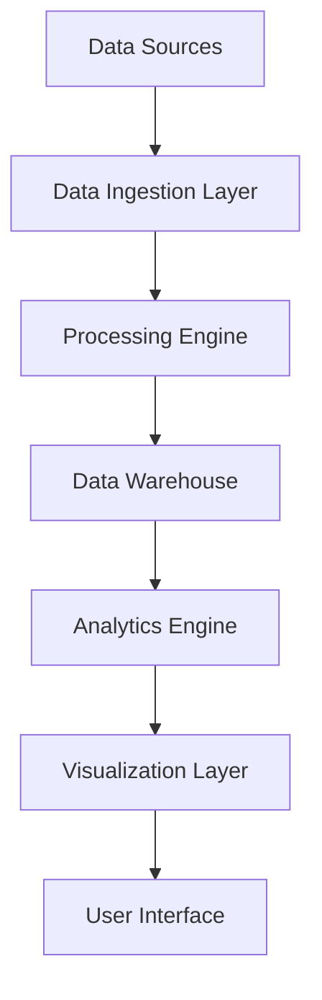

# Advanced Analytics

## Overview
This phase introduces sophisticated analytics capabilities, providing deep insights into user behavior and system performance.

## Current Development Status

### Data Pipeline (90% Complete)
- ✅ **Data Collection**: Multi-source data ingestion
- ✅ **Data Processing**: Real-time and batch processing pipelines
- ✅ **Data Storage**: Optimized data warehouse architecture
- 🔄 **Data Quality**: Automated data validation and cleansing

### Analytics Engine (70% Complete)
- ✅ **Metrics Calculation**: Core business metrics engine
- 🔄 **Predictive Analytics**: Machine learning model integration
- ⏳ **Anomaly Detection**: Automated anomaly detection system
- ⏳ **Forecasting**: Predictive forecasting capabilities

### Visualization & Reporting (60% Complete)
- ✅ **Interactive Dashboards**: Real-time analytics dashboards
- 🔄 **Custom Reports**: User-defined reporting system
- ⏳ **Export Capabilities**: Advanced data export options
- ⏳ **Scheduled Reports**: Automated report generation and delivery

## Technical Architecture

## Key Features in Development

### Real-time Analytics
- Live data streaming and processing
- Instant metric updates and alerting
- Real-time dashboard refreshes
- Event-driven analytics triggers

### Advanced Metrics
- **Cohort Analysis**: User retention and behavior patterns
- **Funnel Analytics**: Conversion rate optimization
- **Segmentation**: Advanced user and behavioral segmentation
- **Attribution**: Multi-touch attribution modeling

## Expected Impact
- **Decision Making**: 80% faster data-driven decisions
- **Performance Insights**: 95% visibility into system performance
- **User Understanding**: 3x improvement in user behavior insights
- **Revenue Optimization**: Projected 25% increase in revenue through analytics-driven optimizations